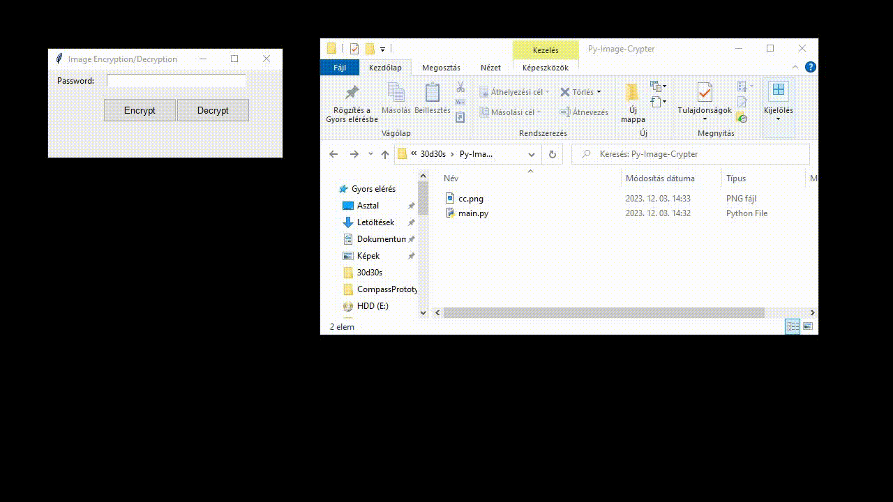

# Image Encryption/Decryption Tool

This is a simple Python script that provides a graphical user interface (GUI) for encrypting and decrypting images using the Python Imaging Library (PIL) and the cryptography library.

## Prerequisites

Make sure you have the required libraries installed before running the script:

```bash
pip install pillow cryptography
```
## Usage

1. Run the script:

    ```bash
    python main.py
    ```
2. The GUI will open, allowing you to choose between encryption and decryption.

3. Enter a password in the provided entry field.

4. Click the "Encrypt" button to encrypt an image or the "Decrypt" button to decrypt an encrypted file.

An example:


## Encryption Process

- **generate_key(password):** Generates a key from the provided password using PBKDF2HMAC.

- **encrypt_text(text, key):** Encrypts the ASCII representation of image pixels using Fernet symmetric encryption.

- **encrypt_image(image_path, password):** Opens an image file, converts pixel values to ASCII, encrypts the ASCII representation, and saves the result in a new file.

## Decryption Process

- **decrypt_text(encrypted_text, key):** Decrypts the ASCII representation of image pixels using the provided key.

- **decrypt_image(encrypted_file, password):** Reads an encrypted file, decrypts the ASCII representation, converts it back to pixel values, and saves the result as a PNG image.

## GUI

- **Password Entry:** Enter the password for encryption or decryption.

- **Encrypt Button:** Opens a file dialog to select an image file for encryption.

- **Decrypt Button:** Opens a file dialog to select an encrypted file for decryption.

- **Result Label:** Displays the outcome of the encryption or decryption process.

## Notes

- The script uses a fixed salt value (`b"salt_123"`) and 100,000 iterations for key derivation. You may consider adjusting these values for stronger security.

- The encrypted file is saved with a `.en` extension, and the decrypted image is saved as a PNG file.

- In case of errors during the process, appropriate error messages will be displayed in the result label.
